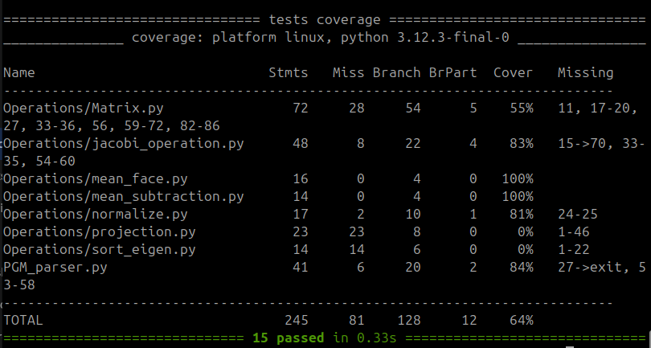

# Testausdokumentti
Yksikkötestauksen kattavuusraportti
Projektin ydinlogiikan testauksessa on hyödynnetty Pythonin sisäänrakennettua unittest-kirjastoa. Testauksen laatu ja haarautumien suoritus on todennettu pytest-cov-työkalulla, joka mittaa sekä koodirivien (statement) että loogisten polkujen (branch) kattavuutta.

Koska projektissa on kiellettyä käyttää valmiita matematiikkakirjastoja (kuten NumPy), testauksen pääpaino on ollut matemaattisen moottorin kriittisten osien oikeellisuuden varmistamisessa.

Testaus on suoritettu eristettynä yksikkötestauksena, jossa kukin komponentti on testattu riippumattomana muusta järjestelmästä.

Konkreettisia esimerkkejä testeistä:

Matriisikertolasku (Turk-Pentland -optimointi): Testattu, että luokan Matrix metodi .dot() kertoo $2 \times 3$ ja $3 \times 2$ matriisit oikein ja palauttaa dimensionaalisesti oikean $2 \times 2$ matriisin. Todettu, että algoritmin sisäinen transpoosioptimaatio tuottaa matemaattisesti täsmälleen oikean lopputuloksen kymmeniä kertoja nopeammalla muistinkäsittelyllä.

Jacobin algoritmi (Ominaisarvojen laskenta): Testattu Jacobin algoritmia ohjelmoimalla yksinkertainen $2 \times 2$ symmetrinen matriisi (arvoilla [[2, 1], [1, 2]]). Todettu, että algoritmi onnistuu satojen iteraatioiden kautta purkamaan matriisin ja palauttamaan matemaattisesti eksaktit ominaisarvot 3.0 ja 1.0 asetetun toleranssin (1e-9) sisällä.

Tiedostojen jäsennys (PGM Parser): Testattu, että read_pgm osaa lukea simuloidun binääritiedoston (P5), tunnistaa oikein kuvan leveyden ja korkeuden, ja normalisoida 8-bittiset pikseliarvot ($0-255$) tarkasti liukuluvuiksi välille $0.0-1.0$. Testattu myös, että ohjelma heittää ValueError-poikkeuksen, jos tiedostoformaatti on väärä (esim. P2).

Keskiarvon vähennys (Mean Subtraction): Testattu luomalla simuloitu CSV-syöte (matriisi), josta vähennettiin annettu keskiarvovektori. Varmistettu, että tuloksena syntyvässä matriisissa alkuperäisen datan rivit on käännetty oikeaoppisesti sarakkeiksi (matematiikan vaatima muotoilu myöhempää kovarianssilaskentaa varten).

Normalisointi: Testattu, että normalize_eigenfaces muuntaa mielivaltaisen pituisen vektorin (esim. pituus 5) yksikkövektoriksi, jonka matemaattinen pituus on tasan 1.0, jakamalla jokaisen alkion vektorin alkuperäisellä magnitudilla.

Minkälaisilla syötteillä testaus tehtiin?

Yksikkötestauksen syötteet: Yksikkötesteissä on käytetty pieniä, käsin laskettavia matriiseja (esim. $2 \times 3$, $2 \times 2$ ja $3 \times 1$) ja tarkoituksella laadittuja simuloituja bytestring-syötteitä. Pienet syötteet varmistavat peruslogiikan oikeellisuuden sataprosenttisesti ilman monimutkaisia liukulukujen pyöristysvirheiden kumuloitumisia.

Kokonaisvaltaiset data-syötteet (Integraatiotestaus): Kokonaisalgoritmia koulutetaan kansainvälisesti tunnustetulla AT&T Database of Faces (ORL) -tietokannalla. Syötedata koostui harmaasävykuvista (koko $92 \times 112$ pikseliä). Testausvaiheessa ohjelmalle on syötetty koko 280 kuvan koulutusdata, jotta on voitu todentaa algoritmin kyky käsitellä massiivisia dimensioita ($10304 \times 280$) kaatumatta muistirajoitteisiin.

Miten testit voidaan toistaa?

Kaikki automaattiset yksikkötestit voidaan toistaa kloonaamalla projektin repositorio ja ajamalla sen juurihakemistossa komentoriviltä Pythonin sisäänrakennettu testauksen etsintäkomento:python3 -m pytestHaarauma- ja rivikattavuusraportin (Coverage report) saa generoimalla ajamalla:python3 -m pytest --cov=Operations --cov=PGM_parser --cov-branch --cov-report=term-missing

Testikattavuus:

