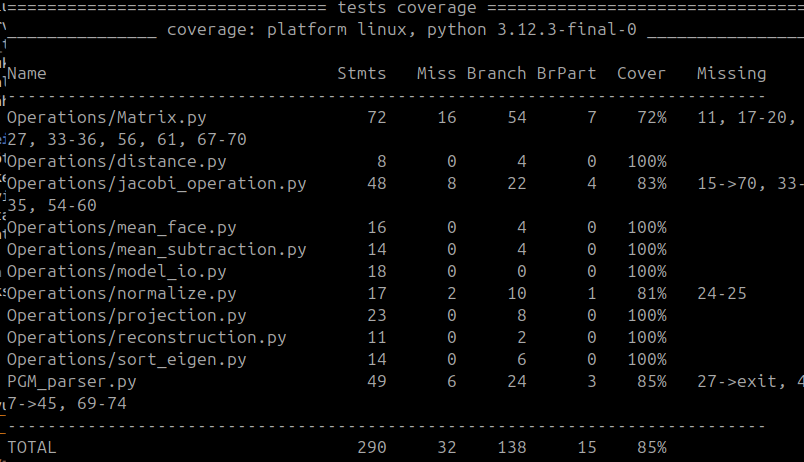

# Testausdokumentti

## Yksikkötestauksen kattavuusraportti
Projektin ydinlogiikan testauksessa on hyödynnetty Pythonin sisäänrakennettua unittest-kirjastoa. Testauksen laatu ja haarautumien suoritus on todennettu pytest-cov-työkalulla, joka mittaa sekä koodirivien (statement) että loogisten polkujen (branch) kattavuutta.

Koska projektissa on kiellettyä käyttää valmiita matematiikkakirjastoja (kuten NumPy), testauksen pääpaino on ollut matemaattisen moottorin kriittisten osien oikeellisuuden varmistamisessa. Testaus on suoritettu eristettynä yksikkötestauksena, jossa kukin komponentti on testattu riippumattomana muusta järjestelmästä.

## Testatut kokonaisuudet (uudet testit mukana)
- Matriisilaskenta: `Matrix.dot`, `transpose`, `elementwise_multiplication` ja `map`.
- Ominaisarvot ja lajittelu: Jacobin algoritmi sekä `sort_eigen`.
- Datan jäsennys: PGM-luku, opetus/testijako ja CSV-kirjoitus.
- Esikäsittely: keskiarvon vähennys ja ominaiskasvojen normalisointi.
- Projektiovaihe: `get_top_k_eigenfaces`, `project_faces`, `extract_labeled_signatures`.
- Etäisyys ja rekonstruktio: euklidinen etäisyys (myös virhetilanne) sekä rekonstruktiovirhe.
- Mallin I/O: mallin tallennus ja lataus JSON-muotoon.
- Tunnistuslogiikka: lähimmän naapurin valinta ja kasvo/ei-kasvo -kynnys.

## Minkälaisilla syötteillä testaus tehtiin?
- Yksikkötestauksen syötteet: Pienet, käsin laskettavat matriisit (esim. $2 \times 2$, $2 \times 3$ ja $3 \times 1$) sekä tarkoituksella rakennetut bytestring-syötteet PGM-parserille. Tämä varmistaa peruslogiikan oikeellisuuden ilman liukulukujen pyöristysvirheiden kumuloitumista.
- Kokonaisvaltaiset data-syötteet (integraatiotasolla): Algoritmia koulutetaan AT&T Database of Faces (ORL) -tietokannalla. Syötedata koostuu harmaasävykuvista (koko $92 \times 112$ pikseliä).

## Miten testit voidaan toistaa?
Kaikki automaattiset yksikkötestit voidaan toistaa ajamalla projektin juurihakemistossa:

```bash
python3 -m pytest
```

Haarauma- ja rivikattavuusraportin saa:

```bash
python3 -m pytest --cov=Operations --cov=PGM_parser --cov-branch --cov-report=term-missing
```

## Testikattavuus
